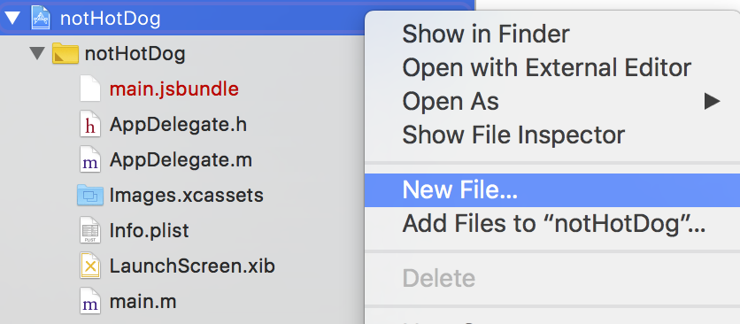
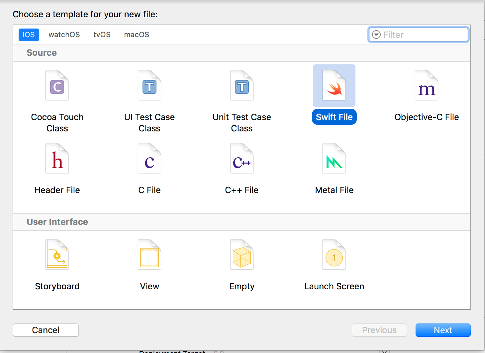
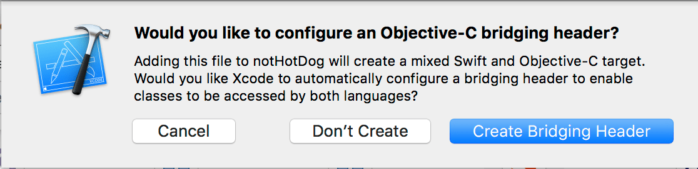
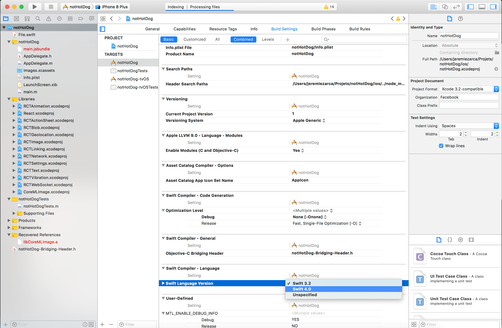
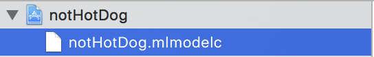
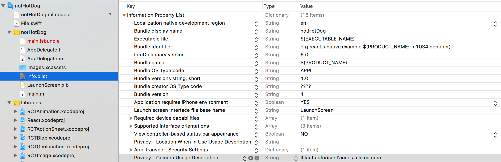

Tout d’abord, il faudra créer un nouveau projet React-Native.
Ouvrez votre terminal, naviguez dans votre dossier de projets et entrez la commande suivante :

```shell
react-native init notHotDog (ou tout autre nom)
```

Au bout de quelques minutes, tout sera installé et vous serez prêt à passer à la suite.

## Installer la librairie CoreML

Nous allons utiliser la librairie react-native-core-ml-image

```shell
npm install --save react-native-core-ml-image
react-native link
```

Allez dans votre projet, puis dans le dossier « ios » et double-cliquez sur le fichier notHotDog.xcodeproj pour l’ouvrir dans Xcode

## Configurer le projet

Par défaut, les projets en React-Native sont configurés pour utiliser principalement Objective-C. La librairie react-native-core-ml-image étant écrite en Swift, il va falloir changer quelques paramètres dans le projet

Tout d’abord, il va falloir ajouter un fichier Swift au projet





Le nom importe peu, il ne sera de toute façon pas utilisé. Un message apparaît alors vous proposant de créer un « Objective-C Bridging Header » : c’est le fichier qui sert à faire le lien entre Swift et les fichiers entête des Classes Objective-C



Enfin, la librairie étant écrite en Swift 4.0, il va falloir spécifier la version de Swift à utiliser (la 3.2 étant la version par défaut).
Cliquez sur la racine du projet (notHotDog), séléctionnez l’onglet « Build Settings », puis tout en bas, changez la version du langage Swift à utiliser.



### Importer le modèle CoreML dans le projet

Avant de passer à la partie programmation, il ne reste plus qu’à importer notre modèle de classification d’images dans le projet notHotDog.
Glissez-déposez le modèle Classifier.mlmodel et renommez-le notHotDog.mlmodelc (non, ce n’est pas une faute de frappe)



CoreML ne fonctionne pas directement avec les fichiers _.mlmodel, il faut d’abord les traduire en _.mlmodelc (c pour compiled), mais notre script Python s’en est déjà occupé. (cf. dernière ligne du fichier train_model.py)

```python
# Export for use in Core ML
model.export_coreml('Classifier.mlmodel')
```

### Autoriser l'accès à la caméra

Dans le fichier Info.plist, cliquez sur le petit plus à la droite de chaque entrée et ajoutez « Privacy – Camera Usage Description » comme montré ci-dessous



C’est tout pour la configuration ! Il ne reste plus qu’à implémenter tout cela.


## Implémenter le code

La première chose à faire est d’importer la librairie react-native-core-ml-image dans le projet. Pour cet exemple, tout le code se situera dans le fichier App.js

```javascript
import CoreMLImage from "react-native-core-ml-image"
```

Ensuite, remplacez toute la méthode render() par ce qui vient ci-après :

```javascript
render() {
    let classification = null;

    if (this.state.bestMatch) {
      if (this.state.bestMatch.identifier && this.state.bestMatch.identifier === "hotdog") {
        classification = "Hotdog";
      } else {
        classification = "Not hotdog";
      }
    }

    return (
      <View style={styles.container}>
          <CoreMLImage modelFile="notHotDog" onClassification={(evt) => this.onClassification(evt)}>
              <View style={styles.container}>
                <Text style={styles.info}>{classification}</Text>
              </View>
          </CoreMLImage>
      </View>
    );
  }
```

La méthode onClassification nous permet de recevoir des updates quand un nouvel objet a été classifié. Il renvoie les données suivantes :

```json
[
  {
    "identifier": "hotdog",
    "confidence": 0.87
  },
  {
    "identifier": "not-hotdog",
    "confidence": 0.4
  }
]
```

Nous n’avons plus qu’à implémenter la méthode onClassification qui se charge de trouver la meilleure classification.

```javascript
const BEST_MATCH_THRESHOLD = 0.5;

/** */

onClassification(classifications) {
    let bestMatch = null;

    if (classifications && classifications.length) {
      classifications.map(classification => {
        if (!bestMatch || classification.confidence > bestMatch.confidence) {
          bestMatch = classification;
        }
      });

      if (bestMatch.confidence >= BEST_MATCH_THRESHOLD) {
        this.setState({
          bestMatch: bestMatch
        });
      }
      else {
        this.setState({
          bestMatch: null
        });
      }
    }

    else {
      this.setState({
        bestMatch: null
      });
    }
  }
```

Si l’on se base sur les données précédentes, alors bestMatch vaudra

```json
{
  "identifier": "hotdog",
  "confidence": 0.87
}
```

### Voici le code complet :

```javascript
import React, { Component } from "react"
import { Platform, StyleSheet, Text, View } from "react-native"
import idx from "idx"

const BEST_MATCH_THRESHOLD = 0.5

import CoreMLImage from "react-native-core-ml-image"

export default class App extends Component<{}> {
  constructor() {
    super()
    this.state = {
      bestMatch: null,
    }
  }

  onClassification(classifications) {
    let bestMatch = null

    if (classifications && classifications.length) {
      classifications.map(classification => {
        if (!bestMatch || classification.confidence > bestMatch.confidence) {
          bestMatch = classification
        }
      })

      if (bestMatch.confidence >= BEST_MATCH_THRESHOLD) {
        this.setState({
          bestMatch: bestMatch,
        })
      } else {
        this.setState({
          bestMatch: null,
        })
      }
    } else {
      this.setState({
        bestMatch: null,
      })
    }
  }

  classify() {
    if (idx(this.state, _ => _.bestMatch.identifier)) {
      if (this.state.bestMatch.identifier === "hotdog") {
        return "Hotdog"
      } else {
        return "Not hotdog"
      }
    }
  }

  render() {
    return (
      <View style={styles.container}>
        <CoreMLImage
          modelFile="notHotDog"
          onClassification={evt => this.onClassification(evt)}
        >
          <View style={styles.container}>
            <Text style={styles.info}>{classify()}</Text>
          </View>
        </CoreMLImage>
      </View>
    )
  }
}

const styles = StyleSheet.create({
  container: {
    flex: 1,
    justifyContent: "center",
    alignItems: "center",
    backgroundColor: "transparent",
  },
  info: {
    fontSize: 20,
    color: "#ffffff",
    textAlign: "center",
    fontWeight: "900",
    margin: 10,
  },
})
```

Il ne vous reste plus qu’à éxecuter le code sur votre iPhone (la caméra ne fonctionnera pas sur le simulateur).

Si vous avez tout bien fait, l’app vous demandera la permission d’accéder à votre appareil photo et vous pourrez alors distinguer un hotdog du teckel de votre voisine.


Merci de m’avoir lu et, si l’article vous a plu, n’hésitez pas à le partager sur les réseaux sociaux.
